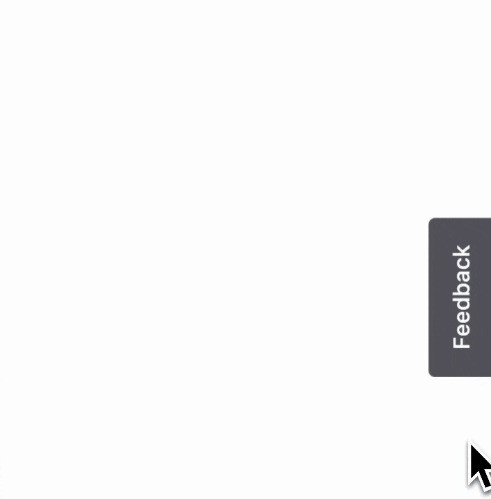

# Hermes WC

Because user feedback should be treated like a gift from the gods.



## What is Hermes WC?

Hermes WC lets you add a simple feedback widget to any web page.

With Hermes WC you can plug in "submission adapters" to send your feedback wherever you want. We offer an adapter for Discord, but we'll be adding more in the future. Please let us know what kind of adapters would be most useful for you!

## Getting Started

To get started using Hermes WC, install the package in your project:

```bash
npm install hermes-wc
```

In your HTML add the following code:

```html
<hermes-wrapper>
  <form class="hermes-stack" data-hermes="form">
    <sl-input
      name="feedback"
      label="Feedback"
      placeholder="e.g., Not clear enough"
    ></sl-input>
    <hermes-score-input
      name="score"
      label="Score"
      score-count="5"
      start-helper-text="Low Score"
      end-helper-text="High score"
    ></hermes-score-input>
    <div class="hermes-row">
      <sl-button data-hermes="close">Close</sl-button>
      <sl-button variant="primary" type="submit">Submit</sl-button>
    </div>
  </form>
</hermes-wrapper>
```

This is the very same markup used to render the Hermes form used in this page.

Next, include the following JavaScript in your page:

```js
import 'hermes-wc/src/style.css';
import { DiscordSubmissionAdapter } from 'hermes-wc/src/submission-adapters/discord.js'
import { initializeHermesForm } from 'hermes-wc/src/index.js'

const cleanup = initializeHermesForm({
  submissionAdapters: [new DiscordSubmissionAdapter({
    webhookUrl: 'your webhook url'
  })],
  submissionCompleteCallback: (response) => { // handle the response }
})

// When you can to clean up the event listeners
cleanup()
```

## What is the code doing?

The initializeHermesForm function registers the web components to the page and sets up a bunch of event listeners. It also returns a cleanup function that you can use to remove the event listeners when you no longer need them.

The hermes-wrapper component sets the open and close state of the form, as well as the positioning of the side button. You can omit this component if you want an inline form.

The form element listens to and reacts to the form submission.

Because Hermes WC uses HTML to handle form submission, you can provide any valid HTML form control as a child of the form element, and Hermes WC will include its value when submitting the data.

To submit a form, use a `<button type="submit"></button>` as a child of the form element. Clicking it will trigger a form submission on click.

By default, Hermes WC uses some [Shoelace](https://shoelace.style) web components to build out the UI of the form. These are interoperable and accessible by default, so they will work regardless of which framework you use.

Hermes WC also exports a hermes-score-input which is a convenience wrapper over Shoelace's radio button components.

## API

### Hermes Wrapper

Handles the open/close state of the modal, as well as the position of the sticky open button.

#### Props

**label:** The label of the sticky open button.

### Hermes Score Input

Displays a radio group.

#### Props

**score-count:** The number of buttons to display
**start-helper-text:** The label to display on the left hand side of the input
**end-helper-text:** The label to display on the right hand side of the input
**name:** The name of the input, which is used in form submission

### initializeHermesForm

Registers the web components and sets up the event listeners.

#### Args

**submissionAdapters:** An array of submission adapters to use. See the submission adapters section for more information.
Submission adapters are used to send the form data to a destination of your choice. We currently offer a Discord submission adapter, but we'll be adding more in the future.
**submissionCompleteCallback:** A callback function that is called when the form submission is complete. The callback is passed the response from the submission adapter.

### Submission Adapters

#### Discord Submission Adapter

Posts the form data to a Discord webhook.

##### Args

**webhookUrl:** The URL of the Discord webhook to post to.

#### Creating a custom submission adapter

Submission adapters are just classes that implement the following interface:

```js
interface SubmissionAdapter {
  submit: (formData) => Promise<void>;
}
```

## Styling your Hermes WC form

Hermes WC offers a few CSS variables you can override to style the form. You can view them [here](https://github.com/andrico1234/hermes-wc/blob/main/src/style.css).

Hermes also applies styles using Shoelace's CSS variables and parts, which you can also override. You can view
the variables [here](https://github.com/shoelace-style/shoelace/blob/next/src/themes/light.css).
The Shoelace documentation also describes how to customise Shoelace components using parts.
